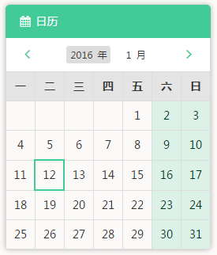
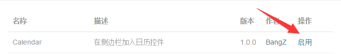

## 基于Typecho的侧边栏日历插件
一个在Typecho博客网站中的侧边栏位置显示日历的小插件

## 演示效果Demo


## 环境要求
安装了Typecho的任意虚拟主机或VPS

## 安装
1、将整个`Calender`文件夹先上传至`/usr/plugins`目录下

2、进入后台管理面板，启动本插件



3、修改当前使用主题的`sidebar.php`，在自己需要的位置加上

```php
<?php if (class_exists("Calendar_Plugin")): ?>
    <div class="list-group">
        <a class="list-group-item active"><i class="fa fa-calendar fa-fw"></i> <?php _e('日历');?></a>
        <?php Calendar_Plugin::render();?>
    </div>
<?php endif;?>
```
